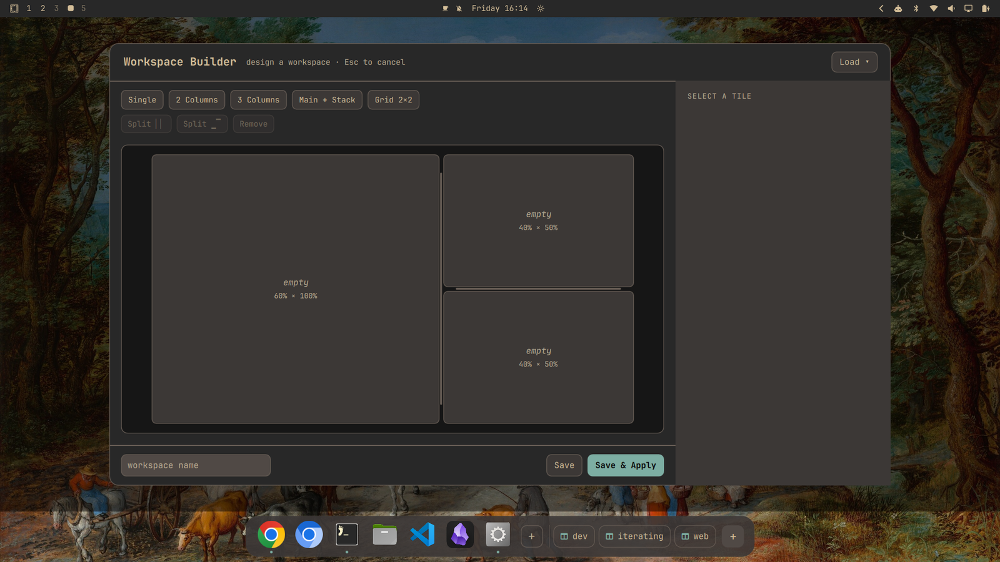

# omaspaces

**Design, save, and summon your Hyprland workspaces — on Omarchy.**



Lay out a workspace visually, save it, and bring it back with a keystroke. A
macOS-style dock keeps your apps and saved layouts one click away. Native
[Quickshell](https://quickshell.org), themed from your Omarchy theme, keyboard-
and mouse-driven, with a small CLI behind it.

## What's in it

- **Editor** — a native visual builder. Pick a template, split tiles, drag the
  dividers, drop an app in each, and **Save & Apply** to build it on a fresh
  workspace. Tile sizes are shown in **real pixels** for your monitor — the
  canvas matches the actual work area (minus the bar and gaps), and resizing (drag
  a divider or use the **W/H** steppers on the selected tile) is clamped to a
  usable minimum so a layout can't produce unusable slivers. Reopen any saved
  space with **Load** and edit it exactly.
- **Dock** — a macOS-style dock: pinned + running apps (icons, running dots,
  hover-magnify; click to launch or focus, right-click to pin/unpin), your saved
  layouts as pills, and a button to build a new space.
- **Layouts** — plain JSON in `~/.config/omarchy/layouts/`, readable and
  writable by hand or by an agent. `apply` places windows pixel-perfectly.

## Install

Omarchy / Arch:

```bash
git clone https://github.com/qlfahey/omaspaces.git
cd omaspaces
./install-omarchy
```

The installer resolves dependencies via Omarchy's package helper and installs
into `~/.local` (no root). Then add the keybindings it prints and `hyprctl
reload`.

**Prebuilt package** (installs system-wide, pulls dependencies):

```bash
sudo pacman -U https://github.com/qlfahey/omaspaces/releases/download/v0.1.3/omaspaces-0.1.3-1-any.pkg.tar.zst
```

Or build it yourself with `makepkg -si` (see [PKGBUILD](PKGBUILD)). AUR
submission is prepared (`./publish-aur.sh`) and coming soon.

Dependencies: `quickshell`, `jq`, `grim`, `hyprland`, `inotify-tools`,
`wl-clipboard`, `python`.

## Use

```bash
omaspaces build          # open the visual editor (Super+Alt+W → "Build a new workspace")
omaspaces menu           # native picker: open a saved workspace, or build one
omaspaces dock           # start the dock (add to autostart to persist)

omaspaces list           # saved layouts
omaspaces apply <name>   # build a saved layout into a fresh workspace
omaspaces save <name>    # snapshot the current workspace as a layout
omaspaces dock pin <id>  # pin / unpin / add apps on the dock
```

### Recommended keybindings

```lua
-- ~/.config/hypr/bindings.lua
o.bind("SUPER + ALT + W", "Workspaces", "omaspaces menu")

-- ~/.config/hypr/autostart.lua
o.launch_on_start("omaspaces dock")
```

## Layout format

A layout is plain JSON — an agent can author one directly:

```jsonc
{
  "name": "deep-work",
  "tiles": [
    { "exec": "code",      "match": "class:Code",           "region": [0.0, 0, 0.66, 1.0] },
    { "exec": "foot",      "match": "class:foot",           "region": [0.66, 0, 0.34, 0.5] },
    { "exec": "nautilus",  "match": "class:org.gnome.Nautilus", "region": [0.66, 0.5, 0.34, 0.5] }
  ]
}
```

`region` is `[x, y, w, h]` as fractions of the monitor work area, so a layout is
resolution-independent. The editor also stores a `tree` for exact round-trip
editing; `apply` ignores it and works off `tiles`.

## License

MIT. See [LICENSE](LICENSE).

Not affiliated with Omarchy; a community tool in the spirit of
[omasnap](https://github.com/tobi/omasnap) and "build your own OS."
